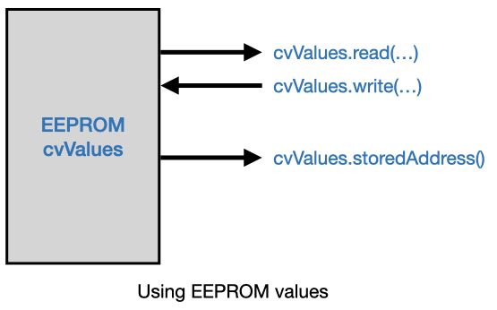
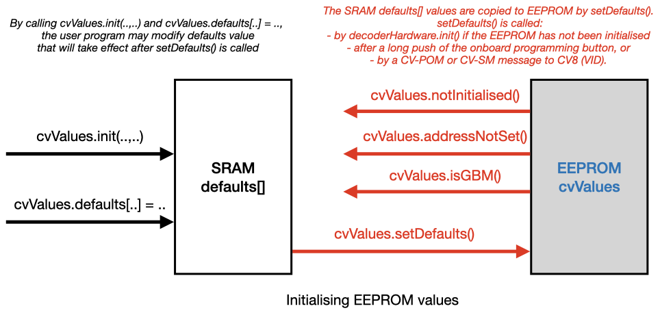

# <a name="CvValues"></a>The CvValues Class #

The CvValues Class allows to read, modify and initialise the  Configuration Variables (CVs). CVs are stored in EEPROM, and keep their values after power down. The user sketch should call `cvValues.init()` as part of its `setup()` function. `cvValues.init()` checks if the EEPROM is still empty, or already filled with CV values. If the EEPROM is still empty, `cvValues.init()` will fill the EEPROM with  default values defined by this library. For different types of decoders this library provides different sets of default values. The user sketch may override these default values, if needed.

----
## Reading and writing CV values ##
The main sketch may read and modify the various CV values, and retrieve the decoders address.

#### uint8_t read(uint8_t number) ####
Returns the value of the specified CV number. See below for the list of the defined CV numbers.

#### void write(uint8_t number, uint8_t value) ####
Sets the specified CV number with the specified value. See below for the list of the defined CV numbers and the acceptable values. Note that for most CVs no check is performed whether the provided value falls within the acceptable range.

#### unsigned int storedAddress(void) ####
Returns the decoder address, and is derived from CV1 and CV9.



___

## Configuration Variables ##

The following Configuration Variables are defined. The variables 1..32 are common for all decoders, the remaining variables are decoder specific.
The default values for the various CVs can be found in [CvValues.cpp](CvValues.cpp).

#### Configuration Variables for all decoders ####
````
myAddrL      = 1;    // 0..63 / 0..255 - Decoder Address low. First address = 1.
T_on_F1      = 3;    // 0..255 - Time on F1 (in 20ms steps). 0 = continuous activation
T_on_F2      = 4;    // 0..255 - Time on F2 (in 20ms steps). 0 = continuous activation
T_on_F3      = 5;    // 0..255 - Time on F3 (in 20ms steps). 0 = continuous activation
T_on_F4      = 6;    // 0..255 - Time on F4 (in 20ms steps). 0 = continuous activation
version      = 7;    // 8..255 - Version should be 8 or higher
VID          = 8;    // 0x0D   - Vendor ID (0x0D = DIY Decoder) / If set to 0x0D, the decoder resets to default settings
myAddrH      = 9;    // 0..3   - Decoder Address high (3 bits)
myRSAddr     = 10;   // 1..128 - RS-bus address (Main address of the Feedback decoder). 0 = undefined
DelayIn1     = 11;   // 0..255 - Delay in 10ms steps before sending OFF signal (conform LENZ LR101)
DelayIn2     = 12;   // same
DelayIn3     = 13;   // same
DelayIn4     = 14;   // same
DelayIn5     = 15;   // same
DelayIn6     = 16;   // same
DelayIn7     = 17;   // same
DelayIn8     = 18;   // same
CmdStation   = 19;   // 0..2   - Master Station: 0 = Roco/Multimouse, 1 = Lenz, 2 = OpenDCC Z1 (Xpressnet V3.6)                    
RSFEC        = 20;   // 0..2   - Number of RS-Bus extra transmissions (Forward Error Correction)
SkipUnEven   = 21;   // 0..1   - Only Decoder Addresses 2, 4, 6 .... 1024 will be used
RSParity     = 22;   // 0..2   - RS-Bus: 0 = ignore parity errors, 1 = retransmit previous, 2 = retransmit always
Search       = 23;   // 0..1   - If 1: decoder LED blinks
RSPulsCount  = 24;   // 0..2   - RS-Bus: 0 = ignore pulse count errors, 1 = retransmit previous, 2 = retransmit always
Restart      = 25;   // 0..1   - To restart (as opposed to reset) the decoder
DccQuality   = 26;   // 0..255 - DCC Signal Quality
DecType      = 27;   // ...    - Decoder Type / See below for acceptable values. Parameter to the class constructor
RailCom      = 28;   // 0      - Bi-Directional (RailCom) Communication Config
Config       = 29;   // ...    - Accessory Decoder configuration
VID_2        = 30;   // 0x0D   - Second Vendor ID (Used by my PoM software to detect these are my decoders)
ParityErrors = 31;   // 0..255 - RS-bus Signal Quality: number of parity errors
PulseErrors  = 32;   // 0..255 - RS-bus Signal Quality: number of pulse count errors
````

#### Configuration Variables for track occupancy decoders (GBM: Gleis Besetz Melder) ####
````
Min_Samples  = 33;   // 0..8   - Number of ON samples before the state is considered stable
Delay_off    = 34;   // 0..255 - Delay (in 100 ms steps) before previous occupancy will be released
Threshold_on = 35;   //10..255 - Above this value a previous OFF sample will be regarded as ON
Threshold_of = 36;   // 5..255 - Below this value a previous ON sample will be regarded as OFF
Speed1_Out   = 37;   // 0..8   - Track number (1..8) for the first speed measurement track (0=none)
Speed1_LL    = 38;   // 0..255 - Length in mm of the first speed measurement track (LSB)
Speed1_LH    = 39;   // 0..20  - Length in mm of the first speed measurement track (MSB)
Speed2_Out   = 40;   // 0..8   - Track number (1..8) for the second speed measurement track (0=none)
Speed2_LL    = 41;   // 0..255 - Length in mm of the second speed measurement track (LSB)
Speed2_LH    = 42;   // 0..20  - Length in mm of the second speed measurement track (MSB)
FB_A         = 43;   // 0..8   - Feedback bit if track A is occupied
FB_B         = 44;   // 0..8   - Feedback bit if track B is occupied
FB_C         = 45;   // 0..8   - Feedback bit if track C is occupied
FB_D         = 46;   // 0..8   - Feedback bit if track D is occupied
FB_S1        = 47;   // 0..8   - Feedback bit if Sensor 1 is active
FB_S2        = 48;   // 0..8   - Feedback bit if Sensor 2 is active
FB_S3        = 49;   // 0..8   - Feedback bit if Sensor 3 is active
FB_S4        = 50;   // 0..8   - Feedback bit if Sensor 4 is active
Polarization = 51;   // 0..1   - If 0: J&K connected normal / if 1: J&K polarization changed
````

#### Configuration Variables for TMC 24 Channel IO decoders ####
````
Min_1Samples = 33;   // 0..8   - Number of ON samples before the state is considered stable
Min_0Samples = 34;   // 0..255 - Delay (in number of samples) before previous occupancy will be released
Int_Samples  = 35;   // 1..255 - Interval between samples (in ms)
Start_Delay  = 36;   // 1..255 - Startup delay (in number of samples)
Offset_PoM   = 37;   // 1..99  - Offset for the PoM address. Actual address = Offset_PoM * 100 + myRSAddr
````

#### Configuration Variables for Switch and Relays-4 decoders ####
````
SendFB       = 33;   // 0..1   - Decoder will send switch feedback messages via the RS-Bus
AlwaysAct    = 34;   // 0..1   - If set, decoder will activate coil / relays for each DCC command received
````

#### Configuration Variables for Servo decoders ####
***Incomplete. Will be extended***
````
LastState    = 33;   // 0..1  - Save last servo position
````

#### Configuration Variables for Relays-16 decoders ####
````
Ract         = 33;   // 0..1   - If relays switches with - (=0) or with + (=1)
RRR1         = 34;   // Relays used for round-robin, relays 1-8  (Port C)
RRR2         = 35;   // Relays used for round-robin, relays 9-16 (Port A)
RInter       = 36;   // Relays decoder, round-robin interval (in seconds)
Mode         = 37;   // 1..3   - Relais decoder mode
````

#### Configuration Variables for Safety decoders ####
````
SendButtonFB = 33;  // 0..1   - Decoder sends feedback via the RS-Bus if the emergency button is pushed
P_Emergency  = 34;  // 1/4    - Which Pin on the X8 connector is for emergency stop. Possible values: 1 .. 4
T_Watchdog   = 35;  // Number of seconds watchdog relay will remain active
T_Emergency  = 36;  // Time after an RS-emergency button push for PC to stop all trains
T_CheckMove  = 37;  // Interval in which we check if PC stopped all trains
T_RS_Push1   = 38;  // Time RS-bus stays ON after a PUSH button is pushed
T_RS_Push2   = 39;  //
T_RS_Push3   = 40;  //
T_RS_Push4   = 41;  //
````
#### Configuration Variables for Lift decoders ####

````
StartHoming  = 33;  // 0..1   - During initialisation decoder starts with a homing cycle
IR_Detect    = 34;  // 0..1   - Disable / Enable the IR detectors to block lift movement
LCD_Display  = 35;  // 0..1   - Disable / Enable the LCD display
Serial_Line  = 36;  // 0,1,2  - Disable / Enable the Serial interface. Enable for GRBL config changes
````
___

## EEPROM Initialisation ##

It turns out that the Arduino IDE may not reliably fill the EEPROM of a processor with initial values. Therefore it was decided to offer a `cvValues.init()` function, which must be called by the user in `setup()` of the main sketch. In turn `cvValues.init()` calls `setDefaults()`, to fill the empty EEPROM with default values, if needed. The `setDefaults()` function will also be called by the core functions after the onboard button is pushed for 5 seconds, or after CV8 is written. The user sketch need not call `setDefaults()` directly, however.

The type of decoder is not a compiler directive, but must be given as parameter to `cvValues.init()`. If the user wishes to override some of the default CV values, this can also be done within `setup()` by writing a new value to `cvValues.defaults[..]`.



#### void init(uint8_t decoderType, uint8_t softwareVersion = 10) ####
`Init()` *must* be called in `setup()` of the main sketch, to set the decoder type. As optional parameter the software version may be specified; if this parameter is omitted a default value of 10 is used. The decoder type is stored in CV27 and determines how the other CVs are interpreted. The following decoder types are defined:
````
SwitchDecoder                     = 0b00010000;   // Switch decoder
SwitchDecoderWithEmergency        = 0b00010001;   // Switch decoder with Emergency board
ServoDecoder                      = 0b00010100;   // Servo Decoder
LiftDecoder                       = 0b00011000;   // Lift Decoder
Relays4Decoder                    = 0b00100000;   // Relays decoder for 4 relays
Relays16Decoder                   = 0b00100001;   // Relays decoder for 16 relays
TrackOccupancyDecoder             = 0b00110000;   // Track Occupancy decoder
TrackOccupancyDecoderWithReverser = 0b00110001;   // Track Occupancy decoder with reverser
TrackOccupancyDecoderWithRelays   = 0b00110010;   // Track Occupancy decoder with relays
TrackOccupancyDecoderWithSpeed    = 0b00110100;   // Track Occupancy decoder with speed measurement
FunctionDecoder                   = 0b01000000;   // Function Decoder
SafetyDecoder                     = 0b10000000;   // Watchdog and safety decoder
````

#### bool addressNotSet(void) ####
Checks if the decoder address has been set or not. In case of track occupancy decoders (GBM: Gleis Besetz Melder) it checks if the RS-Bus address has been set or not.

#### bool isGBM(void) ####
Returns true if the decoder is a track occupancy decoders (GBM: Gleis Besetz Melder). CV27 (`DecType`) is used for this.

----

## Relation to RCN-225 ##

For CV1-CV30 we follow RCN-225, but with a number of exceptions:
 - CV2: not implemented here
 - CV10-16: These CVs are reserved by the NMRA, but are used here for RS-bus address and GBM delay
 - CV17-18: Should be "mirrored address", but used here for GBM delay
 - CV19-27: These CVs are reserved by the NMRA, but are used here for different purposes.
 - CV30:    This CV is reserved by the NMRA, but is used here for the second vendor ID.
 - CV31-32: Should be "pointers to extended area", but are used here for different purposes.

There are two reasons why we deviate from RCN-225. First, for CV11-Cv18 we decided to follow  the Lenz LR101 feedback decoder CVs. Second, we decided to use several of the other NMRA reserved CVs, since these have low CV numbers and are therefore stored at low EEPROM addresses.
The alternative would have been to use the vendor specific part (such as CV33-CV81), but such approach would have cost more EEPROM space.

----
## Address initialisation ##
If the decoder doesn't have a valid address, the onboard LED is slowly blinking. To initialise the decoder with a valid address, or to change the current address, push the onboard programming button shortly (like 1 second). The onboard LED now changes to fast blinking, to indicate that it expects an accessory (=switch) command to set the address. The next accessory (=switch) address received will now be used as the new address. For most decoders this new address should be a valid accessory address (thus in the range between 1 and 1024/2048), but for Occupancy Decoders this new address should be a valid RS-Bus address (thus in the range between 1 and 127; address 128 is already used for PoM feedback messages).

----
## Reset to default CV values ##
The reset the decoder to the default CV values, push the onboard programming button for 5 or more seconds. The default values will now be written to EPROM, and the decoder will restart. Reset also clears the decoder's address, so the onboard LED will now be blinking slowly to indicate that the decoder's address needs to be initialised.

The CV values can also be reset by writing (PoM or SM) 0x0D to CV8.
